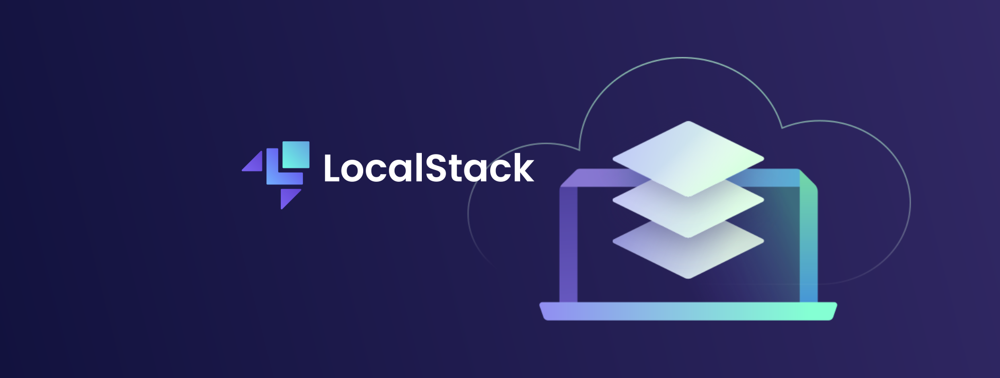

# Simulando AWS CLI com LocalStack

"O principal objetivo desta documentação é fornecer um guia passo a passo abrangente para configurar e utilizar o LocalStack, uma ferramenta essencial para simular um ambiente AWS (Amazon Web Services) em seu ambiente de desenvolvimento local. Ao seguir esta documentação, você será capaz de:

1. Simular Ambiente AWS Localmente: Aprender a simular serviços da AWS, como S3, EC2, Lambda, DynamoDB e outros, em seu próprio ambiente de desenvolvimento, economizando custos e evitando a dependência da AWS real durante o desenvolvimento e testes.

2. Configurar Pré-Requisitos: Esta documentação orienta sobre a instalação de ferramentas essenciais, como o AWS CLI, Docker e Python, necessárias para criar um ambiente de simulação eficaz.

3. Executar LocalStack com Docker: Aprender como baixar, configurar e executar o LocalStack com o Docker, garantindo que as portas corretas estejam abertas para acessar os serviços simulados.

4. Configurar o AWS CLI: Configurar o AWS CLI para se conectar ao ambiente LocalStack, permitindo que você emule serviços AWS localmente.

5. Testar e Desenvolver Localmente: Usar o AWS CLI para interagir com os serviços simulados, como listar e criar buckets S3, executar funções Lambda e trabalhar com bancos de dados DynamoDB, tudo localmente.

6. Lembrar das Etapas Importantes: Fornecer lembretes importantes sobre como ativar o ambiente virtual e iniciar o LocalStack para garantir que sua simulação esteja funcionando corretamente.

<br />

## Sumario

1.  [IAM (Identity and Access Management)](IAM/README.md)
2.  [S3 (Simple Storage Service)](bucket-s3/README.md)
3.  [EC2 (Elastic Compute Cloud)](EC2/README.md)
4.  [Lambda](lambda/README.md)
5.  [DynamoDB](dynamoDB/README.md)
6.  [API Gateway](api-gateway/README.md)
7.  [CloudFormation](cloud-formation/README.md)
8.  [CloudWatch](cloud-watch/README.md)
9.  [SQS (Simple Queue Service)](SQS/README.md)
10. [SNS (Simple Notification Service)](SNS/README.md)
11. [CodeCommit](code-commit/README.md)
12. [CodePipeline](code-pipeline/README.md)
13. [CodeBuild](code-build/README.md)
14. [CodeDeploy](code-deploy/README.md)
15. [KMS (Key Management Service)](KMS/README.md)
16. [Cognito](cognito/README.md)

## Dependencias

 - AWS CLI
 - Docker
 - Python 2.7.x ou o Python 3.4
 - python3-pip
 - python3-venv

 ## Configurando e começando com LocalStack

Para simularmos ambiente da aws de forma local e muito simples, mais primeiro  temos
que instalar o ***AWS CLI*** sigamos abaixo:

Instale o AWS CLI usando um método apropriado para o seu sistema operacional.

[download aws-cli](https://docs.aws.amazon.com/cli/latest/userguide/cli-chap-configure.html#cli-configure-quickstart-install)

Como meu sistema e Linux irei seguir outros passos a seguinte:

Caso nao tenha o python na maquina basta seguir

```bash
sudo apt-get update && sudo apt-get install python3 && sudo apt install python3-pip
```

Agora instale o AWS CLI usando ambiente virtual.

Certifique-se de ter o pacote python3-venv instalado executando o seguinte comando:

```bash
sudo apt install python3-venv
```

Crie um novo diretório onde você deseja criar o ambiente virtual. Por exemplo:

```bash
mkdir myenv
```

Entre no diretorio:

```bash
cd myenv
```

Crie um ambiente virtual usando o seguinte comando: 

```bash
python3 -m venv venv
```

Ative o ambiente virtual executando o comando, sempre que o você quiser rodar AWS CLI, tera
que rodar esse comando do ambiente virtual:

```bash
source venv/bin/activate
```

depois basta instalar awscli de forma isolada para que nao corra risco de 
conflitos de dependencias.

```bash
pip install awscli
```

Lembre-se de que, sempre que precisar usar a AWS CLI, você primeiro precisará ativar o 
ambiente virtual usando o comando ``source venv/bin/activate``.

Após a instalação ser concluída, você pode verificar se a AWS CLI foi instalada corretamente 
digitando o seguinte comando:

```bash
aws --version
```

1. Instale o Docker em seu ambiente local, se ainda não estiver instalado.
2. Baixe e instale o LocalStack usando o Docker Hub. Por exemplo, você pode 
executar o seguinte comando no terminal:

```bash
docker run --rm -it -p 4566:4566 -p 4571:4571 localstack/localstack
```

Ao executar o comando se ele retornar essas informaçoes significa que esta rodando:

```yaml
LocalStack version: 2.0.3.dev
LocalStack build date: 2023-05-06
LocalStack build git hash: 3e778577

2023-05-09T14:59:48.980  INFO --- [-functhread3] hypercorn.error            : Running on https://0.0.0.0:4566 (CTRL + C to quit)
2023-05-09T14:59:48.980  INFO --- [-functhread3] hypercorn.error            : Running on https://0.0.0.0:4566 (CTRL + C to quit)
Ready.
```
Isso iniciará o contêiner LocalStack e exporá as portas 4566 e 4571,
que são usadas para acessar os serviços simulados.

Agora, você pode usar o AWS CLI ou SDKs para se conectar ao LocalStack e interagir 
com os serviços simulados. Certifique-se de configurar a região para 
"us-east-1" e o endpoint para "http://localhost:4566" ao usar o AWS CLI ou SDKs.

Por exemplo, para listar os buckets do Amazon S3 usando o AWS CLI:

```bash
aws --endpoint-url=http://localhost:4566 s3 ls
```

Esse comando ira dar erro pois antes temos que configurar aws-cli em nossa maquina. Sigamos ao
proximo passo.

## Configuração do AWS CLI

Agora temos que configurar aws-cli antes de utilizalo.

Execute o comando:

```bash
aws configure
```

Ele solicitará as seguintes informações:

 - AWS Access Key ID: Insira o ID da chave de acesso da sua conta da AWS.
 - AWS Secret Access Key: Insira a chave de acesso secreta correspondente à chave de acesso 
    ID fornecida anteriormente.
 - Default region name: Insira a região da AWS que deseja usar (por exemplo, 
    "us-east-1" ou "eu-west-1").
 - Default output format: Escolha um formato de saída preferido, como "json", "text" ou "table".
 
 Após inserir todas as informações necessárias, as credenciais serão configuradas e
 armazenadas em um arquivo de configuração no diretório do AWS CLI.

Agora você pode começar a usar a LocalStack para interagir com os serviços da AWS.
Por exemplo, você pode listar os buckets do Amazon S3 usando o seguinte comando:

Como seria com aws-cli: 

```bash
aws s3 ls
```

Com local-stack: 

```bash
aws --endpoint-url=http://localhost:4566 s3 ls
```

Isso retornará uma lista dos buckets disponíveis na sua conta da AWS.

Cada serviço da AWS tem seus próprios comandos e opções específicas que podem
ser exploradas na documentação oficial da AWS CLI.

Vamos agora criar um bucket para demostração de utilização

```bash
aws --endpoint-url=http://localhost:4566 s3 mb s3://my-bucket-to-test
```

Se você quiser pode subistituir o nome "my-bucket-to-test" para nome do bucket que queira.

Ao criar bucket ele retornara a mensagem "make_bucket: my-bucket-to-test" na saida do prompt.

Agora podemos listar nosso bucket:

```bash
aws --endpoint-url=http://localhost:4566 s3 ls
```

ira retornar ``"2023-05-09 12:15:00 my-bucket-to-test"``

## Finish

Lembre-se que sempre ao executar deve se primeiro carregar ambiente vitual e rodar o container:

```bash
source venv/bin/activate
```

```bash
docker run --rm -it -p 4566:4566 -p 4571:4571 localstack/localstack
```